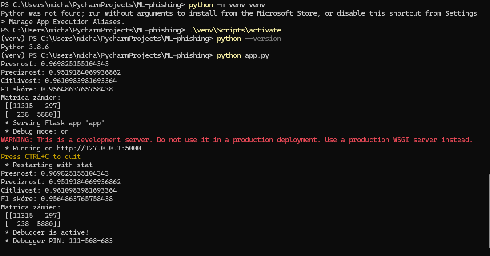
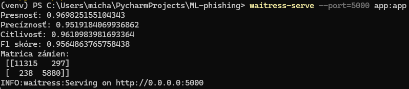

# ML-PHISHING

Identifikácia phishingových web stránok použitím ML. Vytvorím ML model na detektovanie phishingových web stránok pomocou analýzy url patternov, obsahu web stránky a jej metadáta. Zber dostupných datasetov, natrainujem model a spravím evaluáciu modelu.

Run the app by going into the directory ML-phishing in cmd and then run the script by typing python app.py

## Prerequisites
- Python 3.8 or later

## Installation

1. Clone the repository:
   ```bash
   git clone https://github.com/yourusername/ML-phishing.git
   cd ML-phishing

2. Set up virtual env:
python -m venv venv
source venv/bin/activate       # For MacOS/Linux
.\venv\Scripts\activate        # For Windows

3. Install required dependencies:
pip install -r requirements.txt

## Example execution



Afterwards run the app in gunicorn  for unix (pip install gunicorn)

gunicorn -w 4 -b 0.0.0.0:5000 app:app (4 worker processes and bind the app to all network interfaces)

..and use waitress for windows (pip install waitress)

